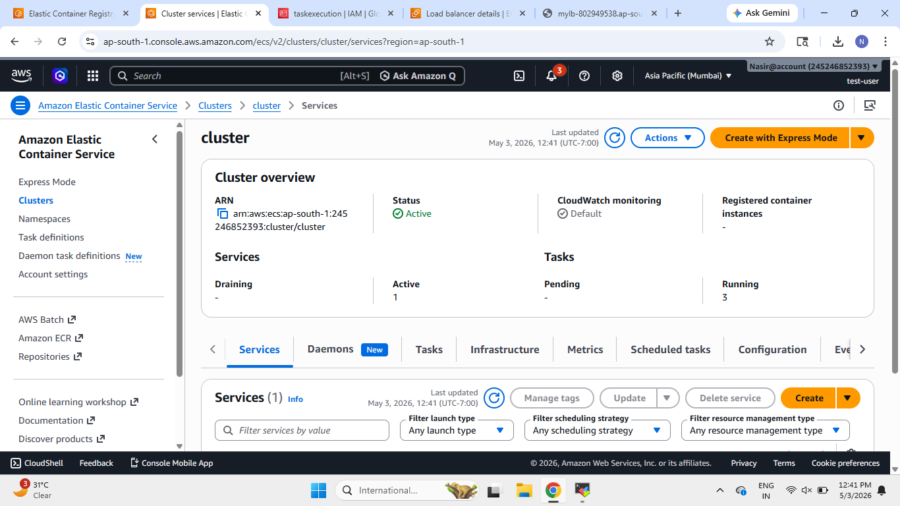
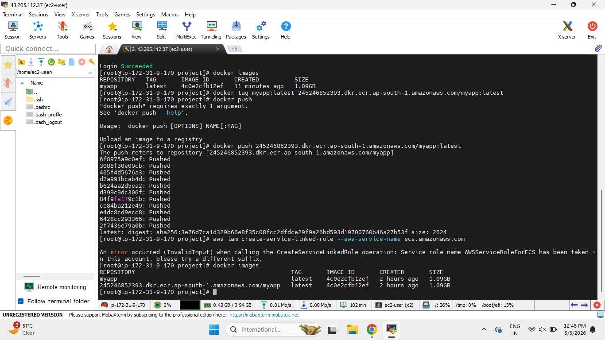
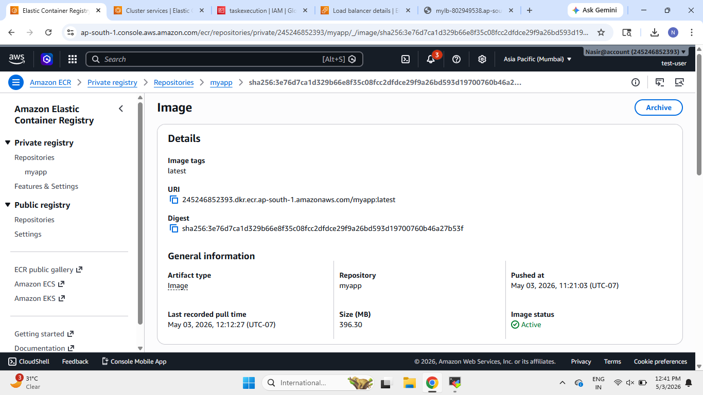
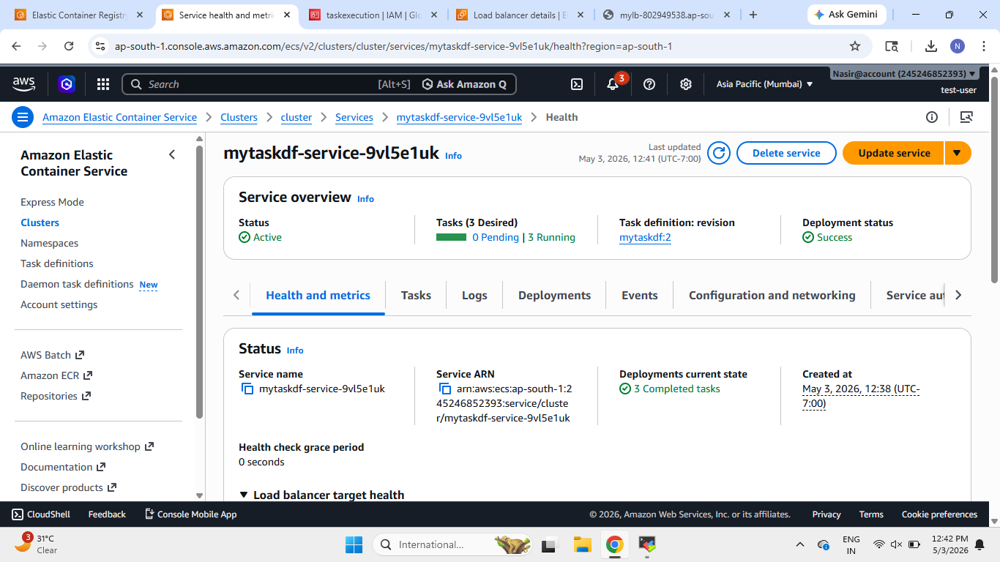
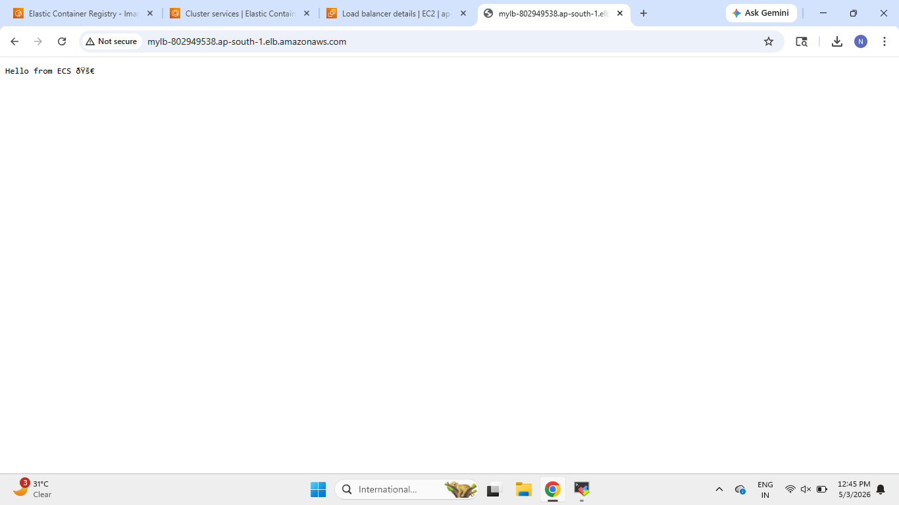

# AWS ECS Fargate Node.js Deployment 🚀

This project demonstrates how to deploy a Dockerized Node.js application on AWS ECS Fargate using:

- Amazon ECS
- AWS Fargate
- Amazon ECR
- Application Load Balancer
- Docker
- Node.js

The application is containerized using Docker, pushed to Amazon ECR, and deployed on ECS Fargate with a public Load Balancer.

--------------------------------------------------

# Project Architecture

```text
Developer
   ↓
Docker Build
   ↓
Amazon ECR Push
   ↓
Amazon ECS Cluster
   ↓
ECS Fargate Service
   ↓
Application Load Balancer
   ↓
Users Access Application
```

--------------------------------------------------

# Technologies Used

- AWS ECS
- AWS Fargate
- Amazon ECR
- Application Load Balancer
- Docker
- Node.js
- Linux

--------------------------------------------------

# Features

✅ Dockerized Node.js Application  
✅ Amazon ECR Image Storage  
✅ ECS Fargate Deployment  
✅ ECS Service Configuration  
✅ Application Load Balancer Integration  
✅ Public Application Access  
✅ Container-Based Deployment Architecture  

--------------------------------------------------

# Repository Structure

```text
.
├── Dockerfile
├── app.js
├── package.json
└── screenshots/
```

--------------------------------------------------

# Application Code

## Node.js Application

The application runs a simple HTTP server on port 3000.

```javascript
const http = require('http');

const server = http.createServer((req, res) => {
  res.end("Hello from ECS 🚀");
});

server.listen(3000);
```

--------------------------------------------------

# Docker Configuration

The application is containerized using Docker.

```dockerfile
FROM node:18

WORKDIR /app

COPY . .

RUN npm install

EXPOSE 3000

CMD ["node", "app.js"]
```

--------------------------------------------------
--------------------------------------------------

# ECS Cluster Setup

This section demonstrates ECS cluster creation and infrastructure setup.

--------------------------------------------------

## 1. ECS Cluster Created Successfully

This screenshot shows:

- ECS Cluster
- Running Tasks
- Active Services
- Cluster Overview

### Screenshot

```md
screenshots/cluster.png
```



--------------------------------------------------
--------------------------------------------------

# Docker Image Build and Push

This section demonstrates Docker image creation and pushing the image to Amazon ECR.

--------------------------------------------------

## 1. Docker Image Push to Amazon ECR

This screenshot shows:

- Docker image tagging
- Amazon ECR login
- Successful Docker image push
- ECR image repository

### Screenshot

```md
screenshots/image-pushed.png
```



--------------------------------------------------

## 2. Amazon ECR Repository Image

This screenshot shows:

- Image stored in Amazon ECR
- Image URI
- Latest image tag
- Repository details

### Screenshot

```md
screenshots/image.png
```



--------------------------------------------------
--------------------------------------------------

# ECS Service Deployment

This section demonstrates ECS Service deployment using AWS Fargate.

--------------------------------------------------

## 1. ECS Service Running Successfully

This screenshot shows:

- ECS Service health
- Running tasks
- Deployment status
- Service overview

### Screenshot

```md
screenshots/service.png
```



--------------------------------------------------

## 2. Application Load Balancer

This screenshot shows:

- Application Load Balancer
- Internet-facing configuration
- DNS endpoint
- Networking details

### Screenshot

```md
screenshots/load-balancer.png
```


--------------------------------------------------
--------------------------------------------------

# Final Application Deployment

The application is successfully deployed and accessible publicly through the Application Load Balancer.

--------------------------------------------------

## 1. Application Successfully Running

This screenshot shows:

- Public application access
- Running Node.js application
- ECS deployment success

### Screenshot

```md
screenshots/application-deployed.png
```



--------------------------------------------------
--------------------------------------------------

# AWS Services Used

- Amazon ECS
- AWS Fargate
- Amazon ECR
- Elastic Load Balancer
- IAM

--------------------------------------------------

# Commands Used

## Docker Build

```bash
docker build -t myapp .
```

--------------------------------------------------

## Docker Tag

```bash
docker tag myapp:latest <ECR-URI>:latest
```

--------------------------------------------------

## Docker Push

```bash
docker push <ECR-URI>:latest
```

--------------------------------------------------

## Run Container Locally

```bash
docker run -p 3000:3000 myapp
```

--------------------------------------------------

# Concepts Covered

- Docker Containerization
- ECS Cluster
- ECS Service
- AWS Fargate
- Amazon ECR
- Application Load Balancer
- Container Deployment
- Public Application Access

--------------------------------------------------

# Conclusion

This project demonstrates a complete container deployment workflow using AWS ECS Fargate.

The project successfully demonstrates:

- Dockerized Application Deployment
- Amazon ECR Image Management
- ECS Fargate Service Deployment
- Load Balancer Integration
- Public Application Access
- Container-Based Infrastructure

AWS ECS Fargate helps deploy and manage containers without managing servers manually.

--------------------------------------------------

# Author

## Nasiroddin Khatib

- GitHub: https://github.com/nasiroddin-khatib
- LinkedIn: https://www.linkedin.com/in/nasiroddin-khatib-269841278/

--------------------------------------------------
